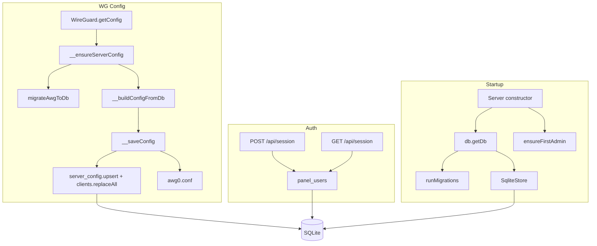

# Документация Amnezia WG-Easy

Краткая сводка по архитектуре, потокам данных и API. Тезисно, с практическими примерами.

---

## 1. Назначение

- **Веб-панель** для AmneziaWG (WireGuard + обфускация под DPI).
- **Один источник правды:** SQLite; файл `awg0.conf` генерируется из БД при каждом сохранении.
- Роли: admin (всё), moderator (клиенты и правила, без настроек и пользователей), user (только просмотр и скачивание конфигов).

### Совместимость с официальным клиентом Amnezia

Сервер собран на образе **amneziavpn/amneziawg-go**: в нём `wg` и `wg-quick` — симлинки на `awg` и `awg-quick` (amneziawg-tools), то есть используется тот же протокол AmneziaWG, что и в официальном приложении. Контракт соблюдён:

| Элемент | Ожидание клиента | Наш сервер |
|--------|-------------------|------------|
| Интерфейс | awg0 (или имя из имени конфига) | `awg0.conf` → интерфейс `awg0` |
| Путь конфига | Обычно `/opt/amnezia/awg` | `WG_PATH` по умолчанию `/opt/amnezia/awg/` |
| [Interface] сервера | PrivateKey, Address, ListenPort, Jc, Jmin, Jmax, S1–S4, H1–H4 | Все поля пишутся в `awg0.conf` |
| [Peer] | PublicKey, AllowedIPs, опционально PresharedKey | То же |
| Клиентский конфиг | [Interface] с Jc, Jmin, Jmax, S1–S4, H1–H4, I1–I5; [Peer] Endpoint, PublicKey, AllowedIPs, PersistentKeepalive | Сборка в `getClientConfiguration()`; Endpoint = `WG_HOST:WG_PORT` |
| Подсеть | Любая (часто 10.8.0.0/24) | `WG_DEFAULT_ADDRESS` по умолчанию `10.8.0.x` |

Конфиги, скачанные или полученные по QR с панели, можно импортировать в официальное приложение Amnezia без изменений.

---

## 2. Точка входа и запуск

| Шаг | Где | Что происходит |
|-----|-----|----------------|
| 1 | `src/server.js` | Единственная точка входа: `main()` создаёт `new Server()` из `lib/Server`, использует синглтон `lib/WireGuard`, вызывает по порядку. Слоя `services/` нет — композиция в `server.js`. |
| 2 | — | `db.getDb()` (через конструктор Server при первом `require`) — каталог БД, открытие SQLite, `runMigrations(db)`. |
| 3 | — | `await ensureFirstAdmin()`: при пустой БД и заданных `ADMIN_USERNAME`/`ADMIN_PASSWORD` создаётся пользователь admin; при отсутствии пользователей — `process.exit(1)`. |
| 4 | — | `await WireGuard.getConfig()`: при необходимости создаётся server_config в БД, сборка конфига из БД, запись awg0.conf, `wg-quick up`, `wg syncconf`; при ошибке — `process.exit(1)`. |
| 5 | — | `applyFirewall()`: сборка дескриптора из БД (глобальные правила + правила профилей для включённых клиентов), применение через nftables/firewalld; при ошибке логируется, при `FIREWALL_FAIL_FAST=1` — `process.exit(1)`. |
| 6 | — | `await server.start()`: сессии (express-session + SqliteStore), два роутера — публичные GET и защищённые API (middleware 401 по panel_users). `Server.start()` не создаёт первого админа — только официальная точка входа `server.js` → `main()` делает это до вызова `server.start()`. |

---

## 3. Поток данных

- **Конфиг в памяти:** один кэш `__config` в WireGuard; при любом изменении клиентов/сервера — сброс; при следующем `getConfig()` — пересборка из БД и перезапись `awg0.conf`.
- **Имена:** в БД и в `db.js` — snake_case; в объектах конфига и API — camelCase. Маппинг в `__buildConfigFromDb` и в `__saveConfig` (clientRows).

---

## 4. БД и миграции

- **Файл:** один SQLite по `DB_PATH` (по умолчанию `WG_PATH/panel.db`).
- **Миграции:** [migrations/001_initial.sql](migrations/001_initial.sql), [migrations/002_soft_delete_obfuscation_firewall.sql](migrations/002_soft_delete_obfuscation_firewall.sql); версии в `schema_migrations`. Таблицу `sessions` создаёт better-sqlite3-session-store. В Docker образе каталог миграций — `/migrations`.
- **Основные таблицы:** `panel_users`, `server_config`, `clients`, `client_config_versions`, `rule_profiles`, `ip_rules`, `global_firewall_rules`, `app_settings`, `protocol_templates`.

---

## 5. Авторизация и роли

- **Вход:** всегда логин + пароль; проверка только по таблице `panel_users` (поиск по username, проверка хэша, запись в сессию userId и role). Первый админ создаётся при старте из `ADMIN_USERNAME` и `ADMIN_PASSWORD`, если в БД ещё нет пользователей; при повторном запуске инициализация пропускается.
- **Проверка доступа:** middleware возвращает 401 для защищённых `/api/*`, если в сессии нет валидного пользователя из БД (`userId` + активный пользователь). Для маршрутов с мутациями вызывается `requireRoles(event, allowedRoles)`:
  - **Только admin:** `PUT /api/app-settings`.
  - **admin и moderator:** создание/удаление/включение/выключение клиентов, смена имени/адреса, `POST /api/signatures/regenerate`.
  - Все авторизованные: GET клиентов, конфигурации, версий, QR, rule-profiles, app-settings, protocol-templates.

---

## 6. Конфиг WG и клиенты

- **Чтение:** `WireGuard.getConfig()` → при отсутствии `server_config` выполняется миграция `awg0.json` в БД (однократно), затем `__buildConfigFromDb()` (сервер + все клиенты из `clients`).
- **Запись:** при любом изменении вызывается `saveConfig()` → `__saveConfig(config)`:
  - В БД: `server_config.upsert`, `clients.replaceAll(clientRows)`; у каждого клиента в строках используется его `updatedAt` (персональный `updated_at`).
  - В файл `awg0.conf` в блоки `[Peer]` попадают только клиенты с `enabled === true` и не истёкшие: `expiresAt == null || new Date(expiresAt) > now`.
- **Ошибки из WireGuard:** `ServerError(message, statusCode)` перехватываются обёрткой над `toNodeListener(app)` и отдаются клиенту с соответствующим HTTP-статусом (404, 400 и т.д.) и телом `{ error: message }`.

---

## 7. API (кратко)

| Группа | Примеры | Примечание |
|--------|---------|------------|
| Сессия | `GET /api/session`, `POST /api/session`, `DELETE /api/session` | Ответ сессии содержит `role` при входе через БД. |
| Клиенты | `GET /api/wireguard/client`, `POST /api/wireguard/client`, `DELETE /api/wireguard/client/:clientId` | В списке клиентов поле `allowedIPs` заполняется из `WG_ALLOWED_IPS`. |
| Конфиг клиента | `GET .../configuration`, `GET .../qrcode.svg`, `GET .../config-versions`, `GET .../config-versions/:versionId/download` | При скачивании configuration в `client_config_versions` пишется снимок (allowed_ips, persistent_keepalive, endpoint из config.js). |
| Мутации клиента | `POST .../enable`, `POST .../disable`, `PUT .../name`, `PUT .../address`, `PUT .../firewall-profile` | При отсутствии клиента — 404 (ServerError). Смена профиля фаерволла сразу обновляет БД и применяет правила. |
| Подписи | `GET /api/signatures/profiles`, `POST /api/signatures/regenerate` | Регенерация — только admin/moderator. |
| Правила и настройки | `GET /api/rule-profiles`, `GET /api/rule-profiles/:id`, `GET /api/app-settings`, `PUT /api/app-settings`, `GET /api/protocol-templates` | PUT app-settings — только admin. |

**Пример потока: скачивание конфига**

1. `GET /api/wireguard/client/:id/configuration?level=1&profile=quic`
2. Middleware 401 → проверка сессии.
3. `WireGuard.getClient({ clientId })` → при отсутствии клиента `ServerError(404)` → обёртка отдаёт 404 и `{ error: "Client Not Found: …" }`.
4. `WireGuard.getClientConfiguration({ clientId, level, profile })` → формирование текста .conf.
5. Вставка строки в `client_config_versions` (allowed_ips, persistent_keepalive, endpoint из config).
6. Ответ: тело конфига, заголовок `Content-Disposition: attachment`.

**Пример потока: создание клиента**

1. `POST /api/wireguard/client` с телом `{ name: "My Client" }`.
2. `requireRoles(event, ['admin', 'moderator'])` → при роли user — 403.
3. `WireGuard.createClient({ name })` → генерация ключей, запись в БД, `__config = null`, `saveConfig()` → пересборка из БД, запись server_config и clients.replaceAll, запись awg0.conf (только включённые и не истёкшие пиры), `wg syncconf`.

---

## 8. Развёртывание (Docker)

- **Скрипт:** `./deploy.sh` создаёт `.env` из `.env.example` при отсутствии. Подставляет `WG_HOST` только если он не задан или остался плейсхолдером (тогда — авто-определение публичного IP); если в `.env` уже указан IP или домен, не перезаписывает. Для первого входа при пустом/плейсхолдере `ADMIN_PASSWORD` генерирует случайный пароль и выводит его в конце. Затем `docker compose up -d --build --force-recreate`.
- **WG_HOST — IP или домен:** в клиентских конфигах в строку `Endpoint` подставляется значение `WG_HOST:WG_PORT`. Можно указать как IP (например `5.144.179.113`), так и доменное имя (например `vpn.example.com`). Резолвит домен **клиент**: при подключении устройство клиента разрешает имя в IP и стучится на этот IP. Серверу не нужно иметь hostname или что-то настраивать под домен — достаточно, чтобы в DNS была A/AAAA-запись, указывающая на IP сервера. То есть домен нужен **только в конфиге клиента** (он туда попадает из `WG_HOST`); на самом сервере достаточно слушать на `0.0.0.0:WG_PORT`.
- **Образ:** Dockerfile копирует `src` в `/app`, `migrations` в `/migrations` (путь из `lib/migrate.js`: `path.join(__dirname, '..', '..', 'migrations')` в рантайме даёт `/migrations`). В образ добавлены `nftables` (для бэкенда фаерволла по умолчанию) и все зависимости для панели и подписей.
- **Старт контейнера:** `entrypoint.sh` при `WG_DEFAULT_DNS=10.8.0.1` запускает dnsmasq, затем `node server.js`. В `server.js` одна последовательность `main()`: `db.getDb()` (миграции) → `ensureFirstAdmin()` → `WireGuard.getConfig()` (запись awg0.conf, `wg-quick up`, `wg syncconf`) → `applyFirewall()` → `server.start()` (HTTP). При любой ошибке до старта HTTP — `process.exit(1)`. Фаерволл при ошибке по умолчанию только логируется; при `FIREWALL_FAIL_FAST=1` процесс завершается.
- **Фаерволл при деплое:** после первой сборки БД создаётся миграциями (в т.ч. `rule_profiles`, `ip_rules`, `global_firewall_rules`). Если нет ни глобальных правил, ни клиентов с профилем — `applyFirewall()` сбрасывает свои цепочки (nftables) или выходит без изменений; иначе применяются правила из БД. Переменная `FIREWALL_BACKEND=nftables` (по умолчанию) или `firewalld`; в `.env.example` можно раскомментировать при необходимости.

---

## 9. Зависимости конфигурации

- **Env / config.js:** порт панели, путь БД, пароль/админ, `WG_PATH`, `WG_HOST`, `WG_PORT`, `WG_ALLOWED_IPS`, `WG_PERSISTENT_KEEPALIVE`, DNS, MTU, `FIREWALL_BACKEND` и т.д. — см. [src/config.js](src/config.js).
- **Первый запуск:** при пустой БД и заданных `ADMIN_USERNAME` и `ADMIN_PASSWORD` создаётся пользователь с ролью admin; если после `ensureFirstAdmin()` пользователей по-прежнему нет, приложение завершается с exit(1) и сообщением задать env.

---

## 10. Фаерволл (nftables / firewalld)

- **Бэкенд:** выбор через переменную окружения `FIREWALL_BACKEND=nftables` (по умолчанию) или `FIREWALL_BACKEND=firewalld`. Правила берутся из БД: глобальные (`global_firewall_rules`), правила профилей (`ip_rules` по `rule_profile_id` клиента). Порядок: сначала глобальные, затем правила профиля; первый совпавший решает; в конце цепочки — ACCEPT.
- **Синхронизация при развёртывании:** при старте приложения после `getConfig()` вызывается `applyFirewall()`. Применяются все актуальные правила (профили и индивидуальные из таблиц) для включённых клиентов. При изменении правил в БД (глобальные правила, смена профиля клиента через UI/API) фаерволл пересобирается автоматически. После enable/disable/create/delete клиента также вызывается `applyFirewall()` (см. [src/lib/WireGuard.js](src/lib/WireGuard.js)).
- **nftables:** в Docker-образе установлен пакет `nftables`; требуются права `CAP_NET_ADMIN` (в docker-compose: `cap_add: [NET_ADMIN]`, `privileged: true`). Базовые правила NAT и FORWARD (PostUp/PostDown в конфиге WG) генерируются в config.js по умолчанию; при заданном вручную `WG_POST_UP` используется значение из env.
- **firewalld:** требуются `firewall-cmd` и демон firewalld. Используется зона `amnezia_wg` и rich rules по исходному IP клиента.

---

## 11. Пользователи и уникальность имени

- **Имя пользователя:** в таблице `panel_users` поле `username` объявлено как `UNIQUE`. При любом API создания или изменения логина нарушение уникальности приводит к ошибке SQLite; слой БД пробрасывает её как исключение с `code: 'USERNAME_EXISTS'`. Соответствующий маршрут должен возвращать HTTP 409 и сообщение вроде «Username already exists». В UI при отображении ошибки от API (логин, создание пользователя и т.д.) проверяется статус 409 или код `USERNAME_EXISTS` и выводится локализованная строка «Имя пользователя уже занято».
