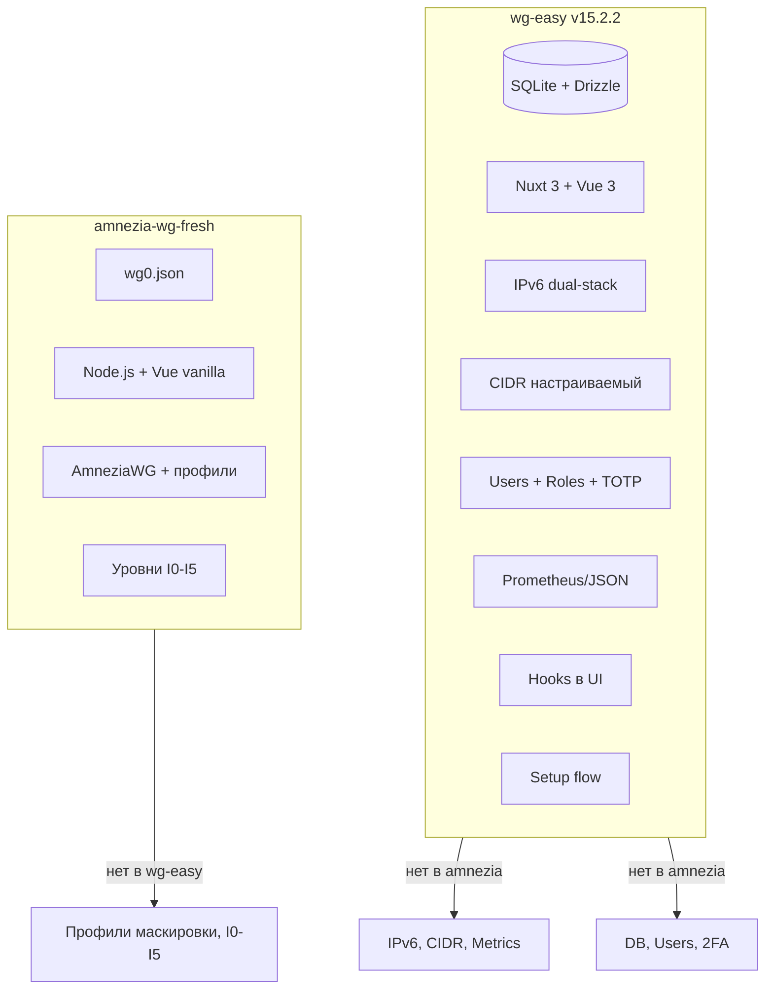

# Систематический анализ различий wg-easy vs amnezia-wg-fresh

Разделённая по категориям сводка различий между актуальным [wg-easy](https://github.com/wg-easy/wg-easy) (v15.2.2, ~400 коммитов, Nuxt, SQLite) и нашим форком amnezia-wg-fresh. Референс: локальная копия wg-easy при необходимости.

---

## 1. Технические различия

### IPv6

| Аспект | wg-easy | amnezia-wg-fresh |
|--------|---------|------------------|
| Подсети | `ipv4Cidr` и `ipv6Cidr` в интерфейсе | Только `10.8.0.x/24` |
| Адреса клиентов | `ipv4Address` + `ipv6Address` (dual-stack) | Только `address` (IPv4) |
| Выдача адресов | `nextIP(4, cidr, clients)` и `nextIP(6, cidr, clients)` | Перебор `10.8.0.2`–`10.8.0.254` в [WireGuard.js](../src/lib/WireGuard.js) |
| Публичный IP | `getPublicIpv4()` и `getPublicIpv6()` через OpenDNS | Только `WG_HOST` из env |
| Отключение | `DISABLE_IPV6=true` | Нет |
| iptables | ip6tables в PostUp/PostDown | Только iptables (IPv4) |

### CIDR и подсети

| Аспект | wg-easy | amnezia-wg-fresh |
|--------|---------|------------------|
| Подсеть | Настраиваемая через UI и env (`INIT_IPV4_CIDR`, `INIT_IPV6_CIDR`) | Фиксированная `WG_DEFAULT_ADDRESS` = `10.8.0.x` |
| Библиотеки | `cidr-tools`, `ip-bigint`, `is-cidr` | Нет |
| API | `admin/interface/cidr.post.ts` | Нет |

### Метрики

| Аспект | wg-easy | amnezia-wg-fresh |
|--------|---------|------------------|
| Prometheus | `/metrics/prometheus` — peers, bytes, handshake | Нет |
| JSON | `/metrics/json` | Нет |
| Пароль | `metrics_password` в general | Нет |

### Хуки (PreUp/PostUp/PreDown/PostDown)

| Аспект | wg-easy | amnezia-wg-fresh |
|--------|---------|------------------|
| Хранение | `hooks_table` в БД, привязка к интерфейсу | Env: `WG_PRE_UP`, `WG_POST_UP`, etc. |
| UI | Редактирование через админку | Нет |
| Шаблоны | `{{ipv4Cidr}}`, `{{ipv6Cidr}}`, `{{device}}`, `{{port}}` | Фиксированные строки в [config.js](../src/config.js) |

### QR и валидация

| Аспект | wg-easy | amnezia-wg-fresh |
|--------|---------|------------------|
| QR | Библиотека `qr`, уровни коррекции при переполнении | `qrcode` npm, фиксированный `errorCorrectionLevel: 'L'` |
| Валидация | Zod-схемы | Минимальная (`Util.isValidIPv4`) |

---

## 2. Архитектурные различия

### База данных

| Аспект | wg-easy | amnezia-wg-fresh |
|--------|---------|------------------|
| Хранилище | SQLite (Drizzle ORM) | Один JSON (`wg0.json`) |
| Миграции | 4 миграции (0000–0003) | Нет |
| Схема | 8 таблиц: clients, users, interfaces, general, hooks, oneTimeLink, userConfig | Вложенный объект `{ server, clients }` |

### Стек приложения

| Компонент | wg-easy | amnezia-wg-fresh |
|-----------|---------|------------------|
| Backend | Nuxt 3 (H3), TypeScript | Node.js, custom HTTP, JS |
| Frontend | Vue 3, Pinia, Nuxt | Vue 2 (vendor), vanilla JS |
| ORM | Drizzle | Нет |
| i18n | @nuxtjs/i18n | Ограниченно (LANG env) |

### WireGuard / AmneziaWG

| Аспект | wg-easy | amnezia-wg-fresh |
|--------|---------|------------------|
| Демон | Автоопределение awg vs wg (`modinfo amneziawg`) | Всегда amneziawg (awg, awg-quick) |
| Путь конфига | `/etc/wireguard/{name}.conf` | `WG_PATH/wg0.conf` (по умолчанию `/opt/amnezia/awg/`) |
| Параметры Amnezia | Jc, Jmin, Jmax, S1–S4, H1–H4, I1–I5 в БД (интерфейс + клиент) | Env + wg0.json, профили I1 (QUIC, DNS, SIP и т.д.) |

---

## 3. Организационные различия

### Мультиаккаунтинг и роли

| Аспект | wg-easy | amnezia-wg-fresh |
|--------|---------|------------------|
| Пользователи | `users_table` (username, password, role, totpKey, totpVerified) | Один пароль из env |
| Роли | ADMIN, USER | Нет |
| Связь | `clients.userId` → `user.id` | Нет |
| Фильтрация | `getForUser`, `getForUserFiltered` | Один список для всех |

### 2FA (TOTP)

| Аспект | wg-easy | amnezia-wg-fresh |
|--------|---------|------------------|
| Поддержка | Да (`otpauth`, `me/totp.post.ts`) | Нет |

### Сессии

| Аспект | wg-easy | amnezia-wg-fresh |
|--------|---------|------------------|
| Механизм | h3 session, `sessionPassword`, `sessionTimeout` | sha256(PASSWORD) + cookie |
| Remember me | `maxAge` при remember | Нет |

### One-time links

| Аспект | wg-easy | amnezia-wg-fresh |
|--------|---------|------------------|
| Таблица | `one_time_links_table` (clientId → link, expiresAt) | Нет |
| Маршрут | `/cnf/[oneTimeLink]` | Нет |

### Срок действия клиента

| Аспект | wg-easy | amnezia-wg-fresh |
|--------|---------|------------------|
| Поле | `clients.expiresAt` | Нет |
| Поведение | Проверка при выдаче конфига | Нет |

### Setup flow

| Аспект | wg-easy | amnezia-wg-fresh |
|--------|---------|------------------|
| Этапы | `/setup/1` … `/setup/4`, `setupStep` в `general_table` | Нет (сразу работа) |
| Миграция | `setup/migrate.post.ts` из старого JSON | Нет |

---

## 4. Прочие различия

### userConfig (дефолты на интерфейс)

В wg-easy: `user_configs_table` — default MTU, keepalive, DNS, allowed IPs, Jc, Jmin, Jmax, I1–I5, host, port. В amnezia-wg-fresh всё из env и [config.js](../src/config.js).

### Информация об IP

wg-easy: endpoint `/admin/ip-info` — публичные IPv4/IPv6, reverse DNS, интерфейсы. amnezia-wg-fresh: только `WG_HOST`.

### Инструменты разработки

- wg-easy: Vitest, ESLint, Prettier, typecheck, `pnpm check:all`
- amnezia-wg-fresh: eslint (базово)

### Документация

- wg-easy: MkDocs, отдельный сайт
- amnezia-wg-fresh: Markdown в `docs/`

---

## 5. Безопасность (низкий приоритет)

- wg-easy: Argon2, PHC format, Zod-валидация, TOTP, роли
- amnezia-wg-fresh: sha256 пароля, минимальная валидация

---

## Сводная диаграмма

---

## Рекомендации по приоритетам переноса

1. **Технические (высокий приоритет):** IPv6, CIDR — дают практическую пользу при dual-stack окружениях.
2. **Архитектурные (средний):** БД — только если планируется рост функций; иначе wg0.json остаётся разумным для «один админ».
3. **Организационные (низкий для текущей цели):** Мультиаккаунт, 2FA, one-time links — не соответствуют модели «инструмент для себя».
4. **Прочие:** Метрики, хуки через UI — полезны, но не критичны для сценария «один сервер, один владелец».

---

## Ссылки

- **wg-easy:** [GitHub](https://github.com/wg-easy/wg-easy), [документация](https://wg-easy.github.io/wg-easy/latest/).
- **amnezia-wg-fresh:** [config.js](../src/config.js), [WireGuard.js](../src/lib/WireGuard.js), [docs/](.).
- **Связанные документы:** [wg-easy-vs-our-project.md](wg-easy-vs-our-project.md), [PROJECT-FEATURES-AND-WG-EASY-GAP.md](PROJECT-FEATURES-AND-WG-EASY-GAP.md), [DIFFERENCES.md](DIFFERENCES.md).
